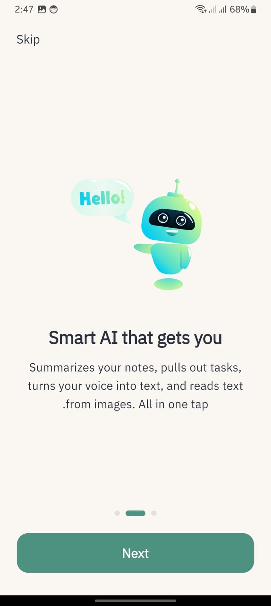
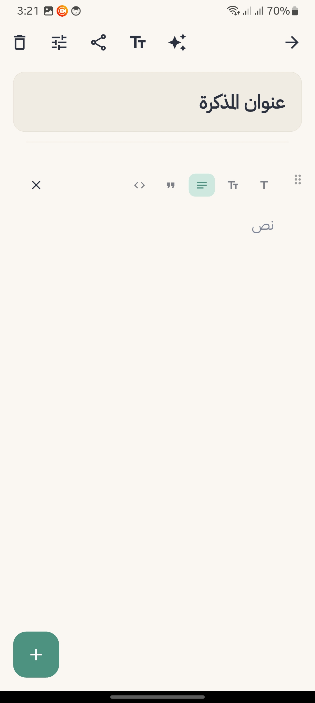
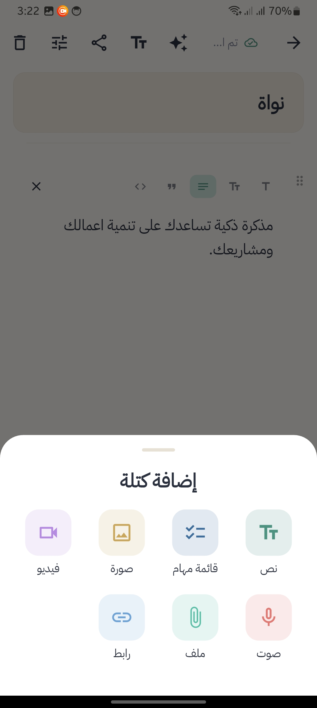
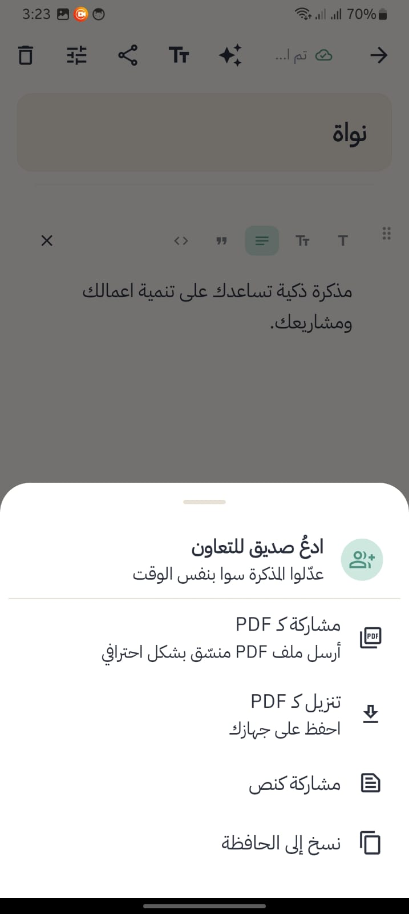
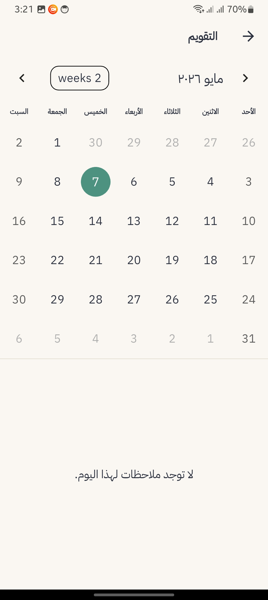
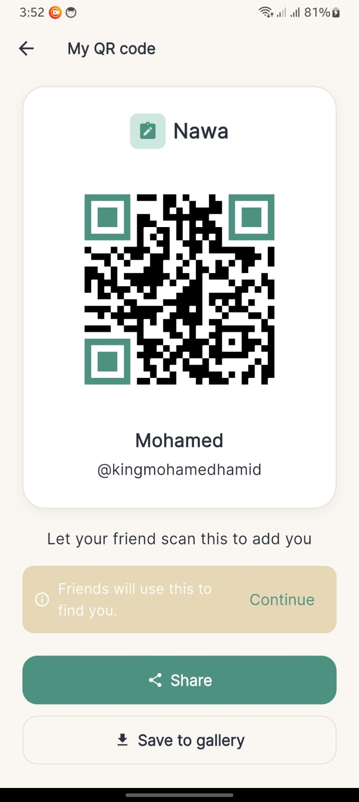
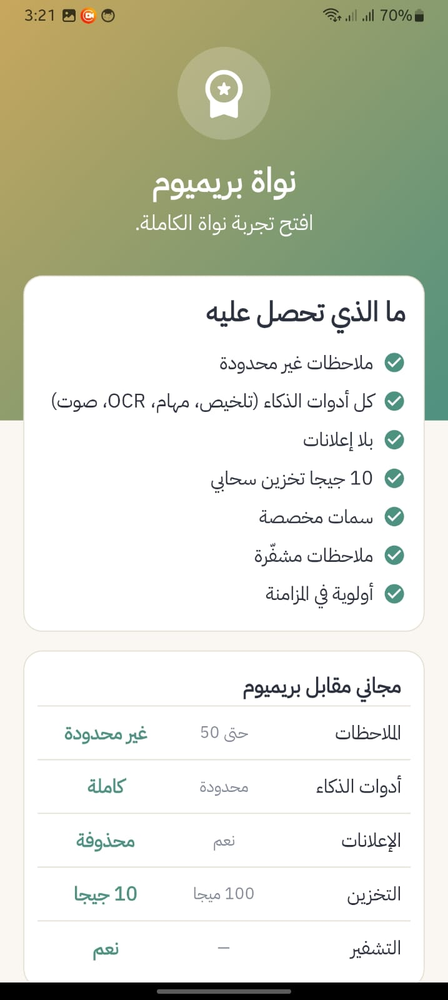
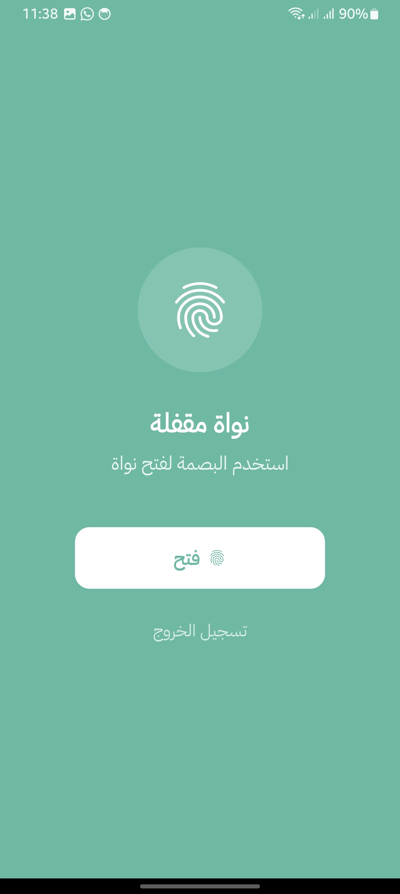

<p align="center">
  
</p>
<h1 align="center">Nawa — نواة</h1>
<p align="center">
  <i>Your smart Arabic-first notes companion</i><br>
  <i>رفيقك الذكي للمذكرات بالعربي أولاً</i>
</p>

<p align="center">
  
  
  
  
  
  
</p>

<p align="center">
  <a href="#english">🇬🇧 English</a> · <a href="#arabic">🇸🇦 العربية</a>
</p>

---

## 📸 Screenshots

<p align="center">
  
  
  
  
</p>
<p align="center">
  
  
  
  
</p>

> 📸 More screenshots in the `screenshots/` folder.

---

## 🌍 English <a name="english"></a>

### About Nawa

Nawa (نواة) means **"core"** or **"seed"** in Arabic — the small thing every great idea starts from. That's exactly what I wanted this app to be: a quiet little place where your ideas land, grow, and stay yours.

I built Nawa for the way *I* take notes — and for every Arabic speaker who got tired of forcing their thoughts into apps that were translated as an afterthought. Nawa is **Arabic-first**: the layout, the typography, the dialect (Khaleeji-friendly), even the day names in the calendar are designed for the language, not bolted on. English is fully supported too, with instant switching.

It's a complete notes platform — block-based editor, multimedia, smart tools, calendar, friend collaboration, biometric lock, offline-first sync — built solo by **Mohamed Hamid** in **Palestine 🇵🇸**.

### ✨ Key Features

#### 📝 Smart Note-Taking
- Block-based editor (text, headings, quotes, code, lists)
- 6 Arabic font choices (default, bold, italic, curved, heavy, monospace)
- Pin & archive notes
- Color-coded notes for quick visual organization
- Encrypt sensitive notes
- Tags and reminders
- Real-time cloud sync indicator ("تم الحفظ")

#### 🎨 Multimedia Blocks
- Add images from gallery or camera
- Voice recordings (with optional live transcription)
- Video attachments
- File attachments
- Web links with previews
- Task checklists

#### 🤖 Smart Tools (Premium)
- Auto-summarize long notes
- Extract tasks/to-dos automatically
- OCR — read text from images
- Voice-to-text transcription
- Available in Arabic and English

#### 📅 Calendar Integration
- Monthly view with full Arabic day names
- See all notes for any selected day
- Set reminders linked to notes
- Auto-shrinks to fit any screen size

#### 👥 Friends & Collaboration
- Add friends via QR code, scan, or username search
- Real-time collaborative editing on shared notes
- Notifications for friend requests and mentions
- "Shared with me" view

#### 📤 Export & Share
- Export notes to professional PDF (with Nawa branding & embedded Arabic font)
- Share as plain text
- Copy to clipboard
- Send PDF via WhatsApp, email, etc.

#### 🌐 True Bilingual Support
- Full Arabic (RTL) and English (LTR)
- Instant language switching (no restart)
- Khaleeji Arabic dialect for Gulf users
- Adapts text direction automatically

#### 🔒 Security
- Biometric app lock (fingerprint / Face ID)
- Encrypted notes option
- Firebase Authentication (Email, Google, Anonymous)
- Per-user Firestore rules

#### 🎨 Theme & Customization
- Light, Dark, and System auto themes
- Custom note colors
- Adjustable text scale
- 6 Arabic font options
- Avatar picker (gallery upload or 12-color initial avatars)

#### ☁️ Offline-First
- Hive local database for instant access
- Auto-sync when online
- Pending operation queue
- Works fully offline

#### 💎 Premium Tier
- Unlimited notes (free tier: 50)
- Full AI tools access
- Ad-free experience
- 10 GB cloud storage
- Custom themes
- Encrypted notes
- Priority sync

#### 🔔 Notifications
- Reminder notifications
- Friend request alerts
- Collaboration updates (with unread badge in the app bar)

#### 📱 Onboarding
- 3-screen Lottie-animated intro
- Skippable
- Multi-language

### 🛠️ Tech Stack

| Layer | Technology |
|-------|-----------|
| **Framework** | Flutter 3.x (Dart 3.x) |
| **State Management** | Riverpod 2.x |
| **Architecture** | MVVM + Clean Architecture + Repository Pattern |
| **Local Database** | Hive (3 boxes: notes, pending_ops, cache) |
| **Backend** | Firebase (Auth, Firestore, Cloud Storage rules) |
| **Cloud Storage** | Cloudinary (for images) |
| **AI Engine** | Google Gemini API |
| **Routing** | go_router |
| **Localization** | easy_localization (ar, en) |
| **Animations** | Lottie + Flutter native |
| **PDF Generation** | pdf + printing packages |
| **QR Code** | qr_flutter + mobile_scanner |
| **Biometrics** | local_auth |
| **Ads** | Google Mobile Ads (AdMob) |
| **Image Picker** | image_picker (gallery + camera) |
| **File Storage** | path_provider + share_plus |
| **Calendar** | table_calendar |
| **Rich Text** | Custom block editor (sealed `NoteBlock` with 7 subclasses) |

### 🏗️ Architecture

```
lib/
├── app/                    # App-level config (theme, router, main app widget)
│   ├── app.dart            # Root MaterialApp
│   ├── router.dart         # go_router configuration
│   └── providers.dart      # Top-level Riverpod providers
│
├── core/                   # Shared utilities and services
│   ├── constants/          # App-wide constants
│   ├── errors/             # Failure types + Result<T>
│   ├── services/           # Cross-cutting services (sync, notifications, ads, PDF, biometrics, AI, etc.)
│   ├── theme/              # Light/dark theme + colors + typography
│   ├── utils/              # Helpers (responsive, validators, logger)
│   └── extensions/         # BuildContext / DateTime extensions
│
├── data/                   # Data layer (offline-first)
│   ├── models/             # Data models (raw maps for Hive)
│   ├── repositories/       # Implementation of domain repos
│   ├── datasources/        # Local (Hive) and remote (Firestore) data sources
│   └── sync/               # Sync service + pending operation queue
│
├── domain/                 # Business logic layer
│   ├── entities/           # Pure Dart entities (NoteBlock sealed class + 7 subclasses)
│   ├── repositories/       # Abstract repository interfaces
│   └── usecases/           # Business use cases
│
├── presentation/           # UI layer (MVVM)
│   ├── views/              # Screens organized by feature
│   │   ├── onboarding/
│   │   ├── auth/
│   │   ├── home/
│   │   ├── note_editor/
│   │   ├── calendar/
│   │   ├── friends/
│   │   ├── notifications/
│   │   ├── settings/
│   │   ├── legal/
│   │   ├── subscription/
│   │   └── ...
│   ├── viewmodels/         # Riverpod StateNotifiers
│   └── widgets/            # Feature-specific widgets
│
└── main.dart               # Entry point + initialization
```

**Why MVVM + Clean Architecture?**
- **Testable**: Each layer can be tested in isolation.
- **Maintainable**: Clear separation of concerns.
- **Scalable**: Easy to add new features without touching existing code.
- **Offline-first**: Data flows through repositories that prefer local cache.

### 🎯 Design Decisions

**Why Riverpod over Bloc/Provider?**
Riverpod's compile-time safety and ease of testing felt like the right fit for a project this size. The provider hierarchy stays flat and there's no boilerplate.

**Why Hive over SQLite?**
Hive's raw key-value storage is faster for note documents that don't need complex queries. The sync service handles the heavy lifting.

**Why Cloudinary for images?**
Firebase Storage requires the Blaze plan. Cloudinary's free tier (25 GB bandwidth, 25 GB storage) is generous enough for early users.

**Why offline-first?**
Users in the MENA region often have spotty connectivity. Notes should work everywhere, sync when possible.

### 🚀 Getting Started

#### Prerequisites
- Flutter 3.x installed
- A Firebase project
- Android Studio or VS Code

#### Setup

```bash
# 1. Clone the repo
git clone https://github.com/mohamedhamid4/nawa.git
cd nawa

# 2. Install dependencies
flutter pub get

# 3. Set up Firebase
# - Create a Firebase project at console.firebase.google.com
# - Add Android app with package: app.nawa.nawa
# - Download google-services.json → place in android/app/
# - For iOS: download GoogleService-Info.plist → place in ios/Runner/

# 4. Configure FlutterFire (optional, recommended)
dart pub global activate flutterfire_cli
flutterfire configure

# 5. Set up environment variables
# Get a Gemini API key from https://aistudio.google.com/apikey
# Pass it at runtime:
flutter run --dart-define=GEMINI_API_KEY=your_key_here

# 6. Deploy Firestore rules
# Copy firestore.rules content to your Firebase Console:
# https://console.firebase.google.com/project/YOUR_PROJECT/firestore/rules
# Or use the CLI:
firebase deploy --only firestore:rules

# 7. Run!
flutter run
```

#### Build for release

```bash
# Android APK
flutter build apk --release --dart-define=GEMINI_API_KEY=your_key

# Android App Bundle (Play Store)
flutter build appbundle --release --dart-define=GEMINI_API_KEY=your_key

# iOS (requires Mac + Xcode)
flutter build ios --release
```

### 📦 Project Structure (Files)

- `firestore.rules` — Production Firestore security rules
- `pubspec.yaml` — All dependencies
- `assets/translations/` — `ar.json` + `en.json`
- `assets/animations/` — Lottie files for onboarding
- `assets/icons/` — App icon and splash logo
- `tool/generate_splash_logos.dart` — Procedural launcher icon + splash generator

### 🗺️ Roadmap

- [x] Core notes editor
- [x] Firebase sync
- [x] Friends + QR sharing
- [x] PDF export (with embedded Cairo font)
- [x] Biometric lock
- [x] Smart summarization (Gemini)
- [x] OCR for images
- [x] Voice-to-text
- [x] Real-time collaboration on shared notes
- [ ] iOS App Store release
- [ ] Web version
- [ ] Desktop (macOS / Windows / Linux)
- [ ] Apple Sign-In
- [ ] In-app purchases (real billing)
- [ ] Smart suggestions ("Continue this note...")
- [ ] Public note sharing via link

### 🐛 Known Issues / Limitations

- iOS bundle ID still uses placeholder values in some configs — needs final updates before App Store submission
- Some skipped frames during cold boot (improving with deferred init)
- AdMob test IDs are still in use — switch to production IDs before launch

### 🤝 Contributing

This is a personal portfolio project, but pull requests are welcome! Open an issue first to discuss any major changes.

### 📄 License

MIT License — see [LICENSE](LICENSE) for details.

---

## 🌍 العربية <a name="arabic"></a>

### عن نواة

كلمة **نواة** عربية أصيلة، ومعناها البذرة — الشي الصغير اللي تبدأ منه كل فكرة كبيرة. وهذا اللي حبيت يكون التطبيق عليه: مساحة هادئة تنزل فيها أفكارك، تنمو، وتظل ملكك إنت بس.

بنيت نواة للطريقة اللي *أنا* أكتب فيها مذكراتي، ولكل واحد عربي مل من إنه يدخل فكرته بتطبيق ترجمته العربية فاحت بشكل ثانوي. نواة **عربية بالأصل**: التصميم، الخطوط، اللهجة (خليجية مريحة)، حتى أسماء أيام الأسبوع في التقويم — كلها انبنت للعربي مش انضافت بعدين. الإنجليزي مدعوم كامل أيضاً، والتبديل بين اللغات لحظي.

تطبيق متكامل لكتابة المذكرات — محرر بنظام الكتل، وسائط متعددة، أدوات ذكية، تقويم، تعاون مع الأصدقاء، قفل بالبصمة، ومزامنة تشتغل بدون إنترنت — بُني بشكل فردي بواسطة المهندس **محمد حميد** من **فلسطين 🇵🇸**.

### ✨ الميزات الرئيسية

#### 📝 تدوين ذكي
- محرر بنظام الكتل (نص، عناوين، اقتباسات، كود، قوائم)
- 6 خطوط عربية مختلفة (افتراضي، عريض، مائل، منحني، ثقيل، مونوسبيس)
- تثبيت وأرشفة المذكرات
- ألوان مخصصة لكل مذكرة للتنظيم البصري
- تشفير المذكرات الحساسة
- وسوم وتذكيرات
- مؤشر مزامنة فوري ("تم الحفظ ☁️")

#### 🎨 كتل متعددة الوسائط
- إضافة صور من المعرض أو الكاميرا
- تسجيلات صوتية (مع تحويل صوتي مباشر اختياري)
- مرفقات فيديو
- مرفقات ملفات
- روابط ويب مع معاينات
- قوائم مهام تفاعلية

#### 🤖 أدوات ذكية (بريميوم)
- تلخيص المذكرات الطويلة تلقائياً
- استخراج المهام تلقائياً
- OCR — استخراج النص من الصور
- تحويل الصوت إلى نص
- متاحة بالعربي والإنجليزي

#### 📅 التقويم
- عرض شهري بأسماء الأيام العربية كاملة
- مشاهدة كل مذكرات أي يوم
- تذكيرات مرتبطة بالمذكرات
- يتكيّف مع كل أحجام الشاشات

#### 👥 الأصدقاء والتعاون
- إضافة الأصدقاء عبر QR، مسح، أو البحث باسم المستخدم
- تعديل تعاوني فوري على المذكرات المشتركة
- إشعارات لطلبات الصداقة والتعاون
- قسم "مشتركة معي"

#### 📤 التصدير والمشاركة
- تصدير المذكرات إلى PDF احترافي (بشعار نواة وخط عربي مدمج)
- مشاركة كنص عادي
- نسخ إلى الحافظة
- إرسال PDF عبر WhatsApp، البريد، إلخ

#### 🌐 دعم لغوي حقيقي
- عربي كامل (RTL) وإنجليزي (LTR)
- تبديل فوري للغة (بدون إعادة تشغيل)
- لهجة خليجية للمستخدمين في الخليج
- يضبط اتجاه النص تلقائياً

#### 🔒 الأمان
- قفل التطبيق بالبصمة (Face ID)
- خيار تشفير المذكرات
- Firebase Authentication (إيميل، Google، ضيف)
- قواعد Firestore لكل مستخدم على حدة

#### 🎨 السمات والتخصيص
- فاتح، داكن، وتلقائي حسب النظام
- ألوان مذكرات مخصصة
- حجم خط قابل للضبط
- 6 خيارات خطوط عربية
- صورة شخصية (رفع من المعرض أو 12 لون رمزي)

#### ☁️ يعمل بدون إنترنت
- قاعدة بيانات Hive محلية للوصول الفوري
- مزامنة تلقائية عند الاتصال
- طابور عمليات معلقة
- يعمل بالكامل دون إنترنت

#### 💎 الباقة المميزة
- مذكرات غير محدودة (المجاني: 50)
- وصول كامل لأدوات الذكاء الاصطناعي
- بدون إعلانات
- 10 جيجا تخزين سحابي
- سمات مخصصة
- مذكرات مشفرة
- أولوية في المزامنة

#### 🔔 الإشعارات
- إشعارات التذكير
- تنبيهات طلبات الصداقة
- تحديثات التعاون (مع شارة في الشريط العلوي)

#### 📱 الترحيب
- 3 شاشات بحركات Lottie
- يمكن تخطيها
- متعدد اللغات

### 🛠️ التقنيات المستخدمة

| الطبقة | التقنية |
|--------|---------|
| **الإطار** | Flutter 3.x (Dart 3.x) |
| **إدارة الحالة** | Riverpod 2.x |
| **المعمارية** | MVVM + Clean Architecture + Repository Pattern |
| **قاعدة البيانات المحلية** | Hive (3 صناديق: notes، pending_ops، cache) |
| **الباك إند** | Firebase (Auth، Firestore، Storage Rules) |
| **التخزين السحابي** | Cloudinary (للصور) |
| **محرّك الذكاء الاصطناعي** | Google Gemini API |
| **التوجيه** | go_router |
| **الترجمة** | easy_localization (ar، en) |
| **الحركات** | Lottie + Flutter native |
| **توليد PDF** | pdf + printing |
| **QR** | qr_flutter + mobile_scanner |
| **البصمة** | local_auth |
| **الإعلانات** | Google Mobile Ads (AdMob) |
| **انتقاء الصور** | image_picker (معرض + كاميرا) |
| **تخزين الملفات** | path_provider + share_plus |
| **التقويم** | table_calendar |
| **النص الغني** | محرر كتل مخصص (sealed `NoteBlock` مع 7 أنواع فرعية) |

### 🏗️ هيكلية المشروع

```
lib/
├── app/                    # إعدادات التطبيق العامة (السمة، التوجيه، الـ widget الجذر)
├── core/                   # الخدمات والأدوات المشتركة
├── data/                   # طبقة البيانات (offline-first)
├── domain/                 # طبقة منطق الأعمال
├── presentation/           # طبقة الواجهة (MVVM)
└── main.dart               # نقطة الدخول
```

- **app/**: إعدادات التطبيق الجذرية — `MaterialApp`، الـ router (go_router)، ومزوّدات Riverpod الأعلى مستوى. هون اللي يربط كل شي ببعضه.
- **core/**: كل شي مشترك — السمات، الألوان، الخطوط، الخدمات (مزامنة، PDF، ذكاء اصطناعي، إشعارات، بصمة...)، أدوات تجاوب الشاشات، ومعالجة الأخطاء.
- **data/**: الطبقة اللي تحكي مع Hive وFirestore وCloudinary. تجمع الداتا من المصادر وتقدّمها للـ domain من خلال repositories.
- **domain/**: قلب البزنس لوجيك. كائنات نقية، interfaces، وuse cases بدون أي تبعية لـ Flutter.
- **presentation/**: الواجهات. كل شاشة لها viewmodel (Riverpod) ومجموعة widgets خاصة فيها.

### 🎯 قرارات التصميم

**ليش Riverpod؟** يعطيني safety وقت الكومبايل، اختبار سهل، ومحدش يلزمك تحط BlocProvider في كل مكان. ولا boilerplate ولا شي.

**ليش Hive؟** أسرع من SQLite للمذكرات اللي ما تحتاج queries معقدة. وقاعدة المزامنة تتكفّل بالباقي.

**ليش Cloudinary مش Firebase Storage؟** Firebase Storage يحتاج Blaze (مدفوع). Cloudinary المجاني يعطيك 25 جيجا تخزين و25 جيجا bandwidth — كافي للبداية.

**ليش offline-first؟** الإنترنت في المنطقة العربية مش دايماً مستقر. المذكرات لازم تشتغل في كل مكان، والمزامنة تصير لما الاتصال يرجع.

### 🚀 البدء

#### المتطلبات
- Flutter 3.x مثبّت
- مشروع Firebase
- Android Studio أو VS Code

#### الإعداد

```bash
# 1. استنسخ المشروع
git clone https://github.com/mohamedhamid4/nawa.git
cd nawa

# 2. ثبّت الحزم
flutter pub get

# 3. اضبط Firebase
# - أنشئ مشروع Firebase من console.firebase.google.com
# - أضف تطبيق Android بمعرّف: app.nawa.nawa
# - نزّل google-services.json → ضعه في android/app/
# - لـ iOS: نزّل GoogleService-Info.plist → ضعه في ios/Runner/

# 4. شغّل FlutterFire (اختياري لكن مستحسن)
dart pub global activate flutterfire_cli
flutterfire configure

# 5. اضبط متغيرات البيئة
# احصل على مفتاح Gemini API من https://aistudio.google.com/apikey
flutter run --dart-define=GEMINI_API_KEY=your_key_here

# 6. انشر قواعد Firestore
firebase deploy --only firestore:rules

# 7. شغّل التطبيق
flutter run
```

#### بناء نسخة الإنتاج

```bash
# Android APK
flutter build apk --release --dart-define=GEMINI_API_KEY=your_key

# Android App Bundle (للنشر على Play Store)
flutter build appbundle --release --dart-define=GEMINI_API_KEY=your_key

# iOS (يحتاج Mac + Xcode)
flutter build ios --release
```

### 🗺️ خارطة الطريق

- [x] محرر المذكرات الأساسي
- [x] مزامنة Firebase
- [x] الأصدقاء + مشاركة عبر QR
- [x] تصدير PDF (مع خط Cairo مدمج)
- [x] قفل بالبصمة
- [x] التلخيص الذكي (Gemini)
- [x] OCR للصور
- [x] تحويل الصوت لنص
- [x] التعاون الفوري على المذكرات المشتركة
- [ ] النشر على App Store (iOS)
- [ ] نسخة الويب
- [ ] نسخة سطح المكتب (macOS / Windows / Linux)
- [ ] تسجيل الدخول بـ Apple
- [ ] الاشتراكات داخل التطبيق (دفع حقيقي)
- [ ] اقتراحات ذكية ("أكمل هذي المذكرة...")
- [ ] مشاركة مذكرات بشكل عام عبر رابط

---

## 👨‍💻 About the Developer / عن المطوّر

<p align="center">
  
</p>

<h3 align="center">Mohamed Hamid · محمد حميد</h3>
<p align="center"><i>Software Engineer · مهندس برمجيات</i></p>

<p align="center">
  Passionate Flutter developer from Palestine 🇵🇸<br>
  مطوّر Flutter شغوف من فلسطين
</p>

### 📬 Get in touch / تواصل معي

I'm available for freelance work, collaborations, or just a chat about code!  
متاح للعمل الحر، التعاون، أو مجرد دردشة عن البرمجة!

- 📧 **Email**: [mohamedhamidofficial4@gmail.com](mailto:mohamedhamidofficial4@gmail.com)
- 🌐 **Portfolio**: [mohamedhamid4.github.io/MohamedHamid.com](https://mohamedhamid4.github.io/MohamedHamid.com/)
- 💼 **Available for hire**: Yes! / نعم!

### 💚 Support

If you find Nawa useful, consider:
- ⭐ Starring this repo
- 🐛 Reporting bugs
- 💡 Suggesting features
- ☕ Buying me a coffee (link soon)

إذا أعجبك نواة:
- ⭐ ضع نجمة على المشروع
- 🐛 بلّغ عن الأخطاء
- 💡 اقترح ميزات جديدة

---

<p align="center">
  Made with 💚 in Palestine 🇵🇸<br>
  صُنع بحب في فلسطين
</p>

<p align="center">
  <i>Nawa — A small seed grows into something great.</i><br>
  <i>نواة — البذرة الصغيرة تكبر لتصبح شيئاً عظيماً.</i>
</p>
